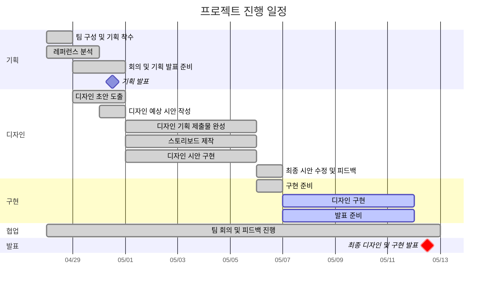

# Minimal Portfolio(1차 프로젝트)

## 2조 버그잡이 (1차 프로젝트: 이스트캠프 사이트 리뉴얼)

+ 과정명 : 이스트캠프 오르미 프론트엔드 개발 13기(React, HTML, CSS, JavaScript)
+ 기간: 2026/04/07 ~ 2026/08/21
+ 1차 프로젝트 : 2026/04/28 ~ 2026/05/12

# 🔗 빠른 링크

+ [기획서](https://www.figma.com/design/IXwcIyqdMVSNVH42znB5oe/2%EC%A1%B0-%EB%B2%84%EA%B7%B8%EC%9E%A1%EC%9D%B4-%EB%94%94%EC%9E%90%EC%9D%B8%EC%8B%9C%EC%95%88?node-id=0-1&t=o41qVon174FWZ1DE-1)
+ [디자인원본](https://www.figma.com/design/IXwcIyqdMVSNVH42znB5oe/2%EC%A1%B0-%EB%B2%84%EA%B7%B8%EC%9E%A1%EC%9D%B4-%EB%94%94%EC%9E%90%EC%9D%B8%EC%8B%9C%EC%95%88?node-id=0-1&t=o41qVon174FWZ1DE-1)

## 1.프로젝트 개요
### 1.1 목표
+ 개인 작업물 전시: 프론트엔드 과정 수료 후 제작한 프로젝트와 포트폴리오를 소개

### 1.2 팀원 🐞

| 이름 | 역할 | 주요 담당 | GitHub | 연락 |
|------|------|------|------|------|
| 이채연 | 팀장, 디자인, 구현 | 히어로 섹션, 지원요건 섹션 디자인 및 구현 | @coudus69 | lcy0269@gmail.com |
| 문송연 | 팀원, 디자인, 구현 | 헤더, 참여이유 섹션, 커리큘럼 섹션 디자인 및 구현 | @ansthddus01-arch | ansthddus01@gmail.com |
| 장도담 | 팀원, 디자인, 구현 | 리뷰 섹션 디자인 및 구현 | @jang98dd | ang98dd@gmail.com |
| 최정민 | 팀원, 디자인, 구현 | 지원혜택 섹션 디자인 및 구현 | @chittybb1357 | chittybb1357@gmail.com |
| 황시원 | 서기, 디자인, 구현, Git 담당자 | 지원독려 섹션, QNA 섹션, 푸터 디자인 및 구현 | @isnow-x | cone2119@naver.com |

### 1.3 마일스톤 📅

#### 1일차 — 프로젝트 이해 & 환경 세팅
- [ ]  Figma 디자인 분석 (레이아웃, 색상, 폰트, 이미지 등 파악)
- [ ]  페이지 구성 요소 목록 작성 (헤더, 네비게이션, 섹션, 푸터 등)
- [ ]  필요한 이미지, 아이콘, 폰트 등의 자산 추출/준비
- [ ]  GitHub 저장소 생성 및 로컬 환경 연결

#### 2일차 — : HTML 구조 구현
- [ ]  시맨틱 태그를 사용하여 전체 HTML 골격 작성
- [ ]  헤더/메뉴/메인 섹션/푸터의 기본 마크업 완료
- [ ]  각 섹션별 더미 텍스트/이미지 삽입

#### 3일차 — CSS 기본 스타일링
- [ ]  Figma 기준 색상, 폰트, 간격 적용
- [ ]  공통 스타일(리셋·폰트·변수) 적용
- [ ]  공통요소 스타일 적용
- [ ]  헤더·메인·푸터 등 주요 파트 스타일 완성

#### 4일차 — 세부 디자인 반영
- [ ]  버튼·폼·이미지 등 세부 요소 스타일링
- [ ]  Figma와 디자인 비교·오차 수정
- [ ]  웹표준 & 웹접근성 검사 및 수정
- [ ]  코드 정리 및 주석 작성

#### 5일차 — 기획/설계
- [ ]  크로스 브라우저 테스트(Chrome, Edge 등)
- [ ]  ReadMe.md 작성
- [ ]  GitHub Pages 배포 설정
- [ ]  배포 후 URL 공유

#### 1일차 — 기획/설계
- [ ]  프로젝트 개요·디자인 특징·구현 과정 정리
- [ ]  스크린샷 및 시연 영상 준비
- [ ]  발표 리허설 & Q&A 준비
- [ ]  발표 진행


### 1.4 간트차트



### 1.5  주요 기능 💡

#### 직관적인 정보 구조 설계
복잡하게 분산되어 있던 교육 정보와 지원 혜택, 커리큘럼 내용을 사용자의 흐름에 맞게 재구성하여 필요한 정보를 빠르게 확인할 수 있도록 개선

---

#### 신청 유도를 고려한 사용자 동선 설계
메인 비주얼부터 지원요건, 혜택, 커리큘럼, 후기 섹션까지 자연스럽게 이어지는 구조를 통해 사용자의 관심을 유지하고 신청 행동까지 연결될 수 있도록 설계

---

#### 인터랙션 기반 UI 구성
슬라이드, 페이지네이션, 버튼 호버 효과 등 다양한 인터랙션 요소를 적용하여 사용자의 집중도를 높이고 몰입감 있는 사용자 경험 제공

---

#### 브랜드 신뢰도를 강화한 비주얼 시스템 구축
보라 계열의 메인 컬러와 일관된 디자인 시스템을 활용하여 프리미엄 교육기관 이미지를 강조하고 안정감 있는 브랜드 경험 제공

---

#### 반응형 웹 기반 사용자 경험 최적화
Desktop, Tablet, Mobile 환경에 맞춘 반응형 레이아웃을 적용하여 다양한 디바이스에서도 일관된 사용성과 가독성 제공

---

#### 교육 과정 및 혜택 정보 시각화
커리큘럼, 지원 혜택, 참여 이유 등의 콘텐츠를 카드형 UI와 섹션 구조로 시각화하여 초보 사용자도 쉽게 이해할 수 있도록 구성


## 2.개발 환경 및 배포 💾

### 2.1 개발 스택

#### Front-end
☑️HTML/CSS

#### Tools
☑️Deployment: VScode
☑️Version Control: GIt & GitHub
☑️Design: Figma

### 2.2 배포 URL

+ [Git](https://isnow-x.github.io/est_1st_project/)


## 3.프로젝트 구조 🗃️

```bash
EST_1ST_PROJECT
│
├── .vscode/                # VS Code 설정 파일
│
├── css/                    # 스타일 파일 폴더
│   ├── common.css          # 공통 스타일
│   ├── index.css           # 메인 페이지 스타일
│   ├── normalize.css       # 브라우저 스타일 초기화 보정
│   └── reset.css           # CSS 기본 초기화
│
├── images/                 # 이미지 및 아이콘 리소스
│
├── common.html             # 공통 레이아웃 및 테스트 페이지
│
└── index.html              # 메인 페이지
```


## 4.향후 개선 사항 🤔

+ 이미지 용량 크기 조정
+ 슬라이드, 클릭 등 인터렉션 기능 css에서 js로 변경 및 추가
+ Lighthouse - Performance 점수 개선
+ 서브페이지 작성


## 5. 제작 후기 📝

이번 프로젝트에서는 이전에 학습했던 HTML과 CSS를 직접 활용하며 퍼블리싱 구현 능력을 더욱 향상시킬 수 있었습니다. 실제 구현 과정에서 코드를 반복적으로 수정하고 개선해보며 코드 구조와 동작 방식에 대한 이해도 또한 높아졌다고 느꼈습니다.

또한 팀원들과 역할을 분담하여 작업을 진행하면서 각자의 디자인 방식과 구현 스타일을 공유할 수 있었고, 부족한 부분은 서로 도움을 주고받으며 완성도 높은 결과물을 만들어낼 수 있었습니다. 협업의 중요성과 소통의 필요성을 함께 경험할 수 있었던 뜻깊은 프로젝트였습니다.


## 6. 기획/디자인 문서 📄
+ 기획서(피그마 슬라이드): 와이어프레임 및 스토리보드, 화면 흐름, 컨셉, 요구사항, 마일스톤 정리
링크: [피그마 슬라이드 바로가기](https://www.figma.com/slides/KDjO7Iy8PPpRHQ8556LfhO)
+ 디자인 원본(피그마): 컴포넌트, 컬러/타이포 스케일, 반응형 레이아웃, 아이콘
링크:[피그마 디자인 바로가기](https://www.figma.com/design/IXwcIyqdMVSNVH42znB5oe/2%EC%A1%B0-%EB%B2%84%EA%B7%B8%EC%9E%A1%EC%9D%B4-%EB%94%94%EC%9E%90%EC%9D%B8%EC%8B%9C%EC%95%88?node-id=786-2291&t=o41qVon174FWZ1DE-1)